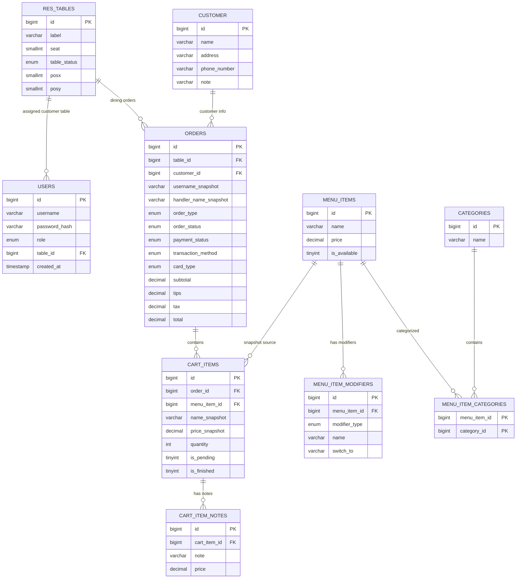

# Database Setup And Migration Notes

The project uses MySQL as the persistent database. The backend expects a database named:

```text
restaurant_pos
```

## Database Files In This Project

| File | Purpose |
| --- | --- |
| `doc/Dump20260503.sql` | Baseline MySQL dump for the project database. |
| `doc/cart-item-notes-migration.sql` | Adds the `cart_item_notes` table used for item notes and optional note prices. |

## Recommended Local Setup

Create the database:

```sql
CREATE DATABASE restaurant_pos;
```

Import the baseline dump:

```bash
mysql -u root -p restaurant_pos < doc/Dump20260503.sql
```

Apply the cart item note migration:

```bash
mysql -u root -p restaurant_pos < doc/cart-item-notes-migration.sql
```

Then start the backend:

```bash
cd pos-back/restaurant-pos
./mvnw spring-boot:run
```

## Backend Database Configuration

Local database settings are in:

```text
pos-back/restaurant-pos/src/main/resources/application.properties
```

Current local values:

```properties
spring.datasource.url=jdbc:mysql://localhost:3306/restaurant_pos
spring.datasource.username=root
spring.datasource.password=admin
spring.jpa.hibernate.ddl-auto=validate
```

`ddl-auto=validate` means the backend validates the schema but does not create or update tables automatically.

## Main Tables

| Table | Purpose |
| --- | --- |
| `users` | Login accounts, roles, and customer table assignment. |
| `res_tables` | Restaurant table labels, seat count, status, and layout position. |
| `orders` | Order header data, payment status, type, totals, table, and customer. |
| `cart_items` | Items inside each order, including menu item snapshots. |
| `cart_item_notes` | Multiple notes/additions per cart item, each with optional price. |
| `menu_items` | Menu item names, prices, availability, and timestamps. |
| `menu_item_modifiers` | Add/remove/switch modifier options for menu items. |
| `categories` | Menu categories. |
| `menu_item_categories` | Join table between menu items and categories. |
| `customer` | Customer contact and delivery/order note information. |

## Simple ER Diagram



## Important Data Rules

- `users.table_id` controls which table a customer account is assigned to.
- `res_tables.table_status` changes when dining orders open, checkout, delete, or close.
- `orders.table_id` can be `NULL` for To Go or Delivery orders.
- `cart_items.name_snapshot` and `cart_items.price_snapshot` protect existing orders from later menu edits.
- `cart_item_notes` allows many notes for one item, and each note can have its own price.
- Checkout sets an order to `COMPLETED` and `PAID`.
- Kitchen item finish only changes cart item status; it does not complete the order.

## Migration Recommendation

For a real production project, replace manual SQL imports with a migration tool such as:

- Flyway
- Liquibase

For this school project, the provided SQL files and this setup guide are enough to explain how the database is created and updated.

